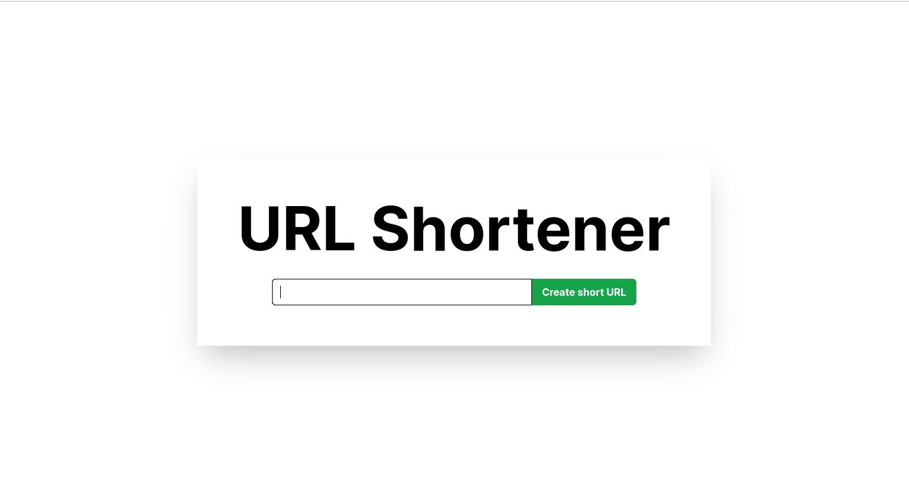
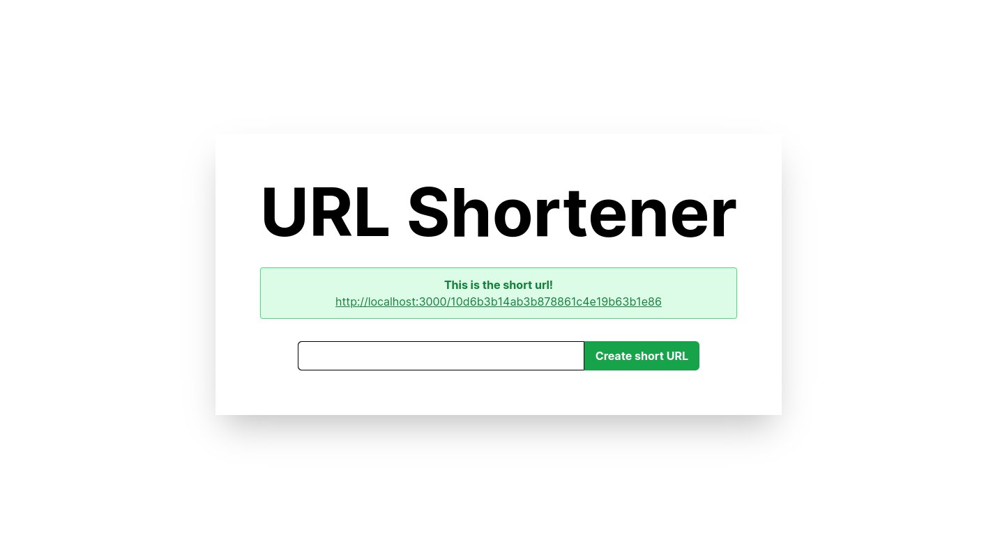

# URL Shortener

# TODO list

- [X] Create Rails app.
- [X] Install Rspec.
- [X] Implement Shortener service.
- [X] Create Link model.
- [X] Create Link resource (only :create).
- [X] Add route to redirect from short url.
- [X] Add cache
- [X] Add TailwindCSS
- [ ] Design mobile and tablet resolutions

# Design

